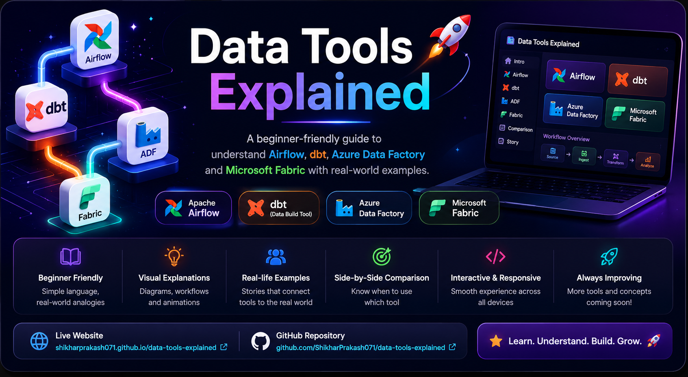

# 🚀 Data Tools Explained

[](https://shikharprakash071.github.io/data-tools-explained/)

An interactive educational web application that simplifies modern Data Engineering and Analytics concepts through visual storytelling, real-world analogies, workflow diagrams, and beginner-friendly explanations.

The project currently covers:

* Apache Airflow
* dbt (Data Build Tool)
* Azure Data Factory (ADF)
* Microsoft Fabric

---

## 🌐 Live Demo

🔗 Live Website

https://shikharprakash071.github.io/data-tools-explained/

---

## 📌 About The Project

Learning Data Engineering can feel overwhelming.

Most tutorials explain tools individually, but rarely answer:

* Why these tools exist
* What problems they solve
* How they work together
* Where they fit in a real-world data pipeline

This project was built to bridge that gap.

Using an interactive slide-based experience, users can understand complex concepts without needing a technical background.

---

## ✨ Features

* Interactive slide navigation
* Responsive design
* Modern dark-themed UI
* Visual workflow diagrams
* Real-world analogies
* Story-based learning approach
* Tool comparison section
* Interview-ready explanations
* Beginner-friendly language

---

## 🎯 Project Goals

* Simplify Data Engineering concepts
* Help beginners understand data pipelines
* Create a visual learning experience
* Demonstrate frontend development skills
* Build a portfolio-ready educational project

---

## 🛠️ Technologies Used

### Frontend

* HTML5
* CSS3
* Vanilla JavaScript

### Development & Deployment

* Git
* GitHub
* GitHub Pages
* Visual Studio Code

### Design Concepts

* Interactive Navigation
* Responsive Design
* Visual Storytelling
* Workflow Diagrams
* Modern Dark UI

---

## 📂 Project Structure

```text
data-tools-explained/
│
├── assets/
│   ├── project-banner.png
│   └── favicon2.png
│
├── css/
│   └── style.css
│
├── js/
│   └── script.js
│
├── index.html
│
├── README.md
│
└── .gitignore
```

---

## 📚 Topics Covered

### 1️⃣ Apache Airflow

Learn how workflow orchestration helps automate and manage data pipelines.

**Key Concepts**

* Workflow Orchestration
* Scheduling
* DAGs
* Automation
* Monitoring
* Task Dependencies

**Real-World Analogy**

> Airflow is the manager that ensures every task happens in the correct order.

---

### 2️⃣ dbt (Data Build Tool)

Learn how raw data becomes analytics-ready data.

**Key Concepts**

* Data Transformation
* Data Modeling
* SQL Workflows
* Data Quality Testing
* Documentation

**Real-World Analogy**

> dbt is the cleaner that transforms messy data into useful information.

---

### 3️⃣ Azure Data Factory (ADF)

Learn how data moves between different systems.

**Key Concepts**

* Data Integration
* ETL & ELT
* Cloud Data Pipelines
* Data Ingestion
* Automated Data Movement

**Real-World Analogy**

> ADF is the delivery service that transports data from one place to another.

---

### 4️⃣ Microsoft Fabric

Learn how Microsoft combines analytics, engineering, warehousing, and visualization into a unified platform.

**Key Concepts**

* Data Factory
* Data Engineering
* Data Warehouse
* Power BI
* Unified Analytics Platform

**Real-World Analogy**

> Fabric is a shopping mall where everything exists under one roof.

---

## 🧠 Learning Methodology

Instead of relying on technical jargon, this project teaches concepts through:

### Visual Learning

* Workflow diagrams
* Process visualizations
* Pipeline illustrations

### Storytelling

Users follow realistic business scenarios to understand how modern data teams work with these tools.

### Real-World Analogies

Complex concepts are mapped to everyday examples to make learning easier and more memorable.

---

## 🔄 How These Tools Work Together

A typical modern data pipeline looks like this:

```text
Data Sources
      │
      ▼
Azure Data Factory
(Move Data)
      │
      ▼
Database / Warehouse
      │
      ▼
dbt
(Transform Data)
      │
      ▼
Power BI
(Visualization)
```

Airflow can orchestrate the entire workflow.

Microsoft Fabric can unify most of these components into a single platform.

---

## 💡 Why I Built This Project

While learning Data Analytics, Business Intelligence, and Data Engineering, I realized that understanding individual tools wasn't enough.

The real challenge was understanding:

* Why companies use them
* How they fit together
* When to use each one

This project started as a personal learning resource and evolved into a visual guide that I hope can help other beginners understand these concepts more easily.

It also gave me an opportunity to strengthen my skills in frontend development, documentation, Git, and technical communication.

---

## 🎓 Skills Demonstrated

### Technical Skills

* HTML
* CSS
* JavaScript
* Git
* GitHub
* GitHub Pages

### Data Skills

* Data Engineering Fundamentals
* Workflow Orchestration
* Data Pipelines
* Data Transformation
* Cloud Analytics Platforms

### Professional Skills

* Technical Writing
* Documentation
* Educational Content Design
* Problem Simplification
* Visual Communication

---

## 🚀 Future Roadmap

Planned additions include:

* Snowflake
* Databricks
* Apache Spark
* Azure Synapse
* Apache Kafka
* Power BI
* Tableau
* SQL Server

Additional improvements:

* Search functionality
* Interactive quizzes
* Architecture diagrams
* Mobile-first optimization
* Accessibility improvements
* Light/Dark theme switching

---

## 🤝 Contributing

Contributions, suggestions, and feedback are welcome.

If you'd like to improve the project:

1. Fork the repository
2. Create a feature branch
3. Commit your changes
4. Open a Pull Request

---

## 👨‍💻 Author

### Shikhar Prakash

Aspiring Data Analyst | Business Intelligence Enthusiast | Data Engineering Learner

🔗 LinkedIn

https://www.linkedin.com/in/shikharprakash071/

🔗 GitHub

https://github.com/ShikharPrakash071

---

## ⭐ Support

If you found this project useful, consider giving the repository a star.

It helps others discover the project and supports future improvements.

---

Built with curiosity, continuous learning, and a passion for making complex data concepts easier to understand.
